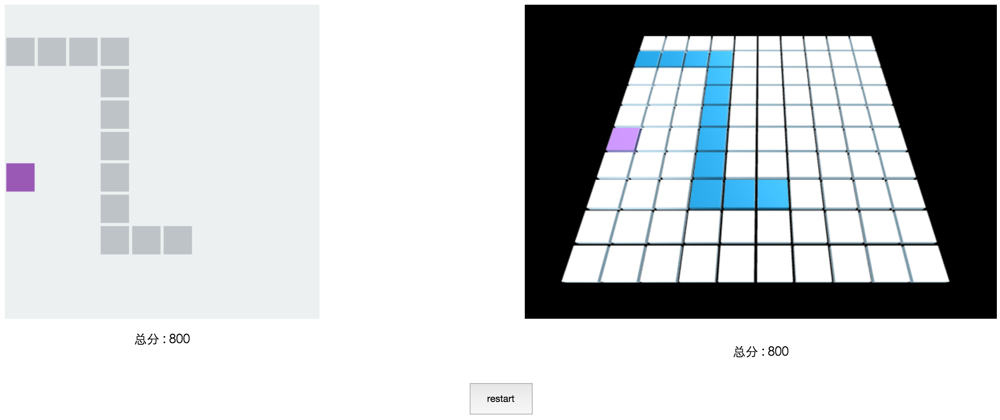

### 使用es6和canvas以及threejs实现的贪吃蛇

使用步骤：

* 执行npm install安装构建环境

* bower install下载依赖的threejs文件

* 执行gulp es-snake执行es6模块加载和js代码整合

* 在个人服务器中运行index.html，开始游戏

效果如图：

控制:

up : w

down : s

left : a

right : d
